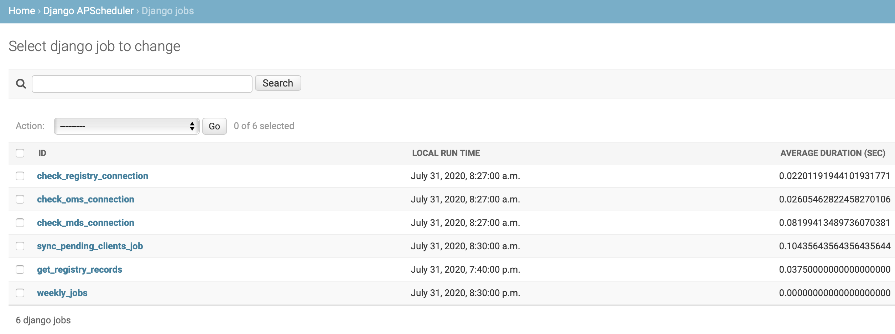
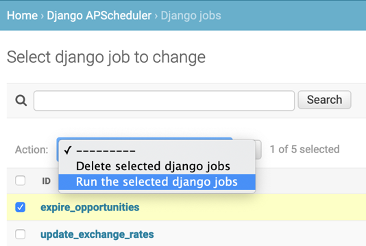

Django APScheduler
==================

[](https://badge.fury.io/py/django-apscheduler)
[](https://pypi.org/project/django-apscheduler)
[](https://pepy.tech/project/django-apscheduler)
[](https://travis-ci.org/jarekwg/django-apscheduler)
[](https://codecov.io/gh/jarekwg/django-apscheduler)
[](https://pypi.org/project/black)

[APScheduler](https://github.com/agronholm/apscheduler) for [Django](https://github.com/django/django).

This is a Django app that adds a lightweight wrapper around APScheduler. It enables storing persistent jobs in the database using Django's ORM.

Features of this package include:

- A custom `DjangoJobStore`: an [APScheduler job store](https://apscheduler.readthedocs.io/en/latest/extending.html#custom-job-stores)
  that persists scheduled jobs to the Django database. You can view the scheduled jobs and monitor the job execution
  directly via the Django admin interface:
  
  
  
- The job store also maintains a history of all job executions of the currently scheduled jobs, along with status codes
  and exceptions (if any):
  
  
  
- **Note:** APScheduler will [automatically remove jobs](https://apscheduler.readthedocs.io/en/latest/userguide.html#removing-jobs)
  that are not scheduled to trigger again from the job store. This will also delete the corresponding job execution
  entries for that job from the database (i.e. job execution logs are only maintained for 'active' jobs.)
    
- Job executions can also be triggered manually via the DjangoJob admin page:

  
  
- **Note:** In order to prevent long running jobs from causing the Django request to time out, the combined maximum run
  time for all APScheduler jobs started in this way is 15 seconds. This timeout value can be configured via the 
  `APSCHEDULER_RUN_NOW_TIMEOUT` setting.

Installation
------------

```python
pip install django-apscheduler
```

Quick start
-----------

- Add ``django_apscheduler`` to your ``INSTALLED_APPS`` setting like this:
```python
INSTALLED_APPS = (
    # ...
    "django_apscheduler",
)
```

- The format for displaying run time timestamps in the Django admin site is configurable using ``APSCHEDULER_DATETIME_FORMAT``.
  The default just adds seconds to the standard Django format. This is useful for displaying the exact run time of jobs
  that are scheduled to run on intervals of less than a minute. 
```python
APSCHEDULER_DATETIME_FORMAT =  "N j, Y, f:s a"  # Default
```

- Run `python manage.py migrate` to create the django_apscheduler models.

- Add a [custom Django management command](https://docs.djangoproject.com/en/dev/howto/custom-management-commands/) to your project
  that schedules the APScheduler jobs and starts the scheduler:
  
```python
# runapscheduler.py
import logging

from django.conf import settings

from apscheduler.schedulers.blocking import BlockingScheduler
from apscheduler.triggers.cron import CronTrigger
from django.core.management.base import BaseCommand
from django_apscheduler.jobstores import DjangoJobStore
from django_apscheduler.models import DjangoJobExecution


logger = logging.getLogger(__name__)


def my_job():
    #  Your job processing logic here... 
    pass

def delete_old_job_executions(max_age=604_800):
    """This job deletes all apscheduler job executions older than `max_age` from the database."""
    DjangoJobExecution.objects.delete_old_job_executions(max_age)


class Command(BaseCommand):
    help = "Runs apscheduler."

    def handle(self, *args, **options):
        scheduler = BlockingScheduler(timezone=settings.TIME_ZONE)
        scheduler.add_jobstore(DjangoJobStore(), "default")
        
        scheduler.add_job(
            my_job,
            trigger=CronTrigger(second="*/10"),  # Every 10 seconds
            id="my_job",  # The `id` assigned to each job MUST be unique
            max_instances=1,
            replace_existing=True,
        )
        logger.info("Added job 'my_job'.")

        scheduler.add_job(
            delete_old_job_executions,
            trigger=CronTrigger(
                day_of_week="mon", hour="00", minute="00"
            ),  # Midnight on Monday, before start of the next work week.
            id="delete_old_job_executions",
            max_instances=1,
            replace_existing=True,
        )
        logger.info(
            "Added weekly job: 'delete_old_job_executions'."
        )

        try:
            logger.info("Starting scheduler...")
            scheduler.start()
        except KeyboardInterrupt:
            logger.info("Stopping scheduler...")
            scheduler.shutdown()
            logger.info("Scheduler shut down successfully!")
```

- This management command should be invoked via `./manage.py runapscheduler` whenever the web server serving your Django
  application is started. The details of how and where this should be done is implementation specific, and depends on
  which web server you are using and how you are deploying your application to production. For most people this should
  involve configuring a [supervisor](http://supervisord.org) process of sorts. 
  
- Register any APScheduler jobs as you would normally. Note that if you haven't set `DjangoJobStore` as the `'default'`
  job store, then you will need to include `jobstore='djangojobstore'` in your `scheduler.add_job` calls.


Caveats
-------

django-apscheduler assumes that you are already familiar with APScheduler and its proper use. If not, then please head
over to the project page and have a look through the [APScheduler documentation](https://apscheduler.readthedocs.io/en/latest/index.html).

Most importantly: **your choice of scheduler [matters](https://apscheduler.readthedocs.io/en/latest/userguide.html#choosing-the-right-scheduler-job-store-s-executor-s-and-trigger-s)**.
If you would prefer running a `BackgroundScheduler` directly in your Django application so that you can add and remove
jobs dynamically at runtime, instead of using a `BlockingScheduler` in a separate Django management command on a fixed
execution schedule as outlined above, then you should be aware of the following potential issues and limitations that
are imposed by APScheduler:

- Using APScheduler with uWSGI requires some additional [configuration steps](https://apscheduler.readthedocs.io/en/latest/faq.html#how-can-i-use-apscheduler-with-uwsgi)
  in order to re-enable threading support.
  
- If you intend to run more than one worker process as part of your [Django deployment in production](https://docs.djangoproject.com/en/3.0/howto/deployment/#deploying-django),
  then it is likely that you will have to [implement your own remote processing](https://apscheduler.readthedocs.io/en/latest/faq.html#how-do-i-share-a-single-job-store-among-one-or-more-worker-processes)
  logic to ensure that a single `DjangoJobStore` can be used by all of the worker processes in a coordinated and
  synchronized way. Neglecting this step could result in jobs being missed or executed multiple times, as well as
  duplicate entries in the `DjangoJobExecution` tables being created.
  
## Project resources

- [Changelog](docs/changelog.md)
- [Release procedures](docs/releasing.md)
